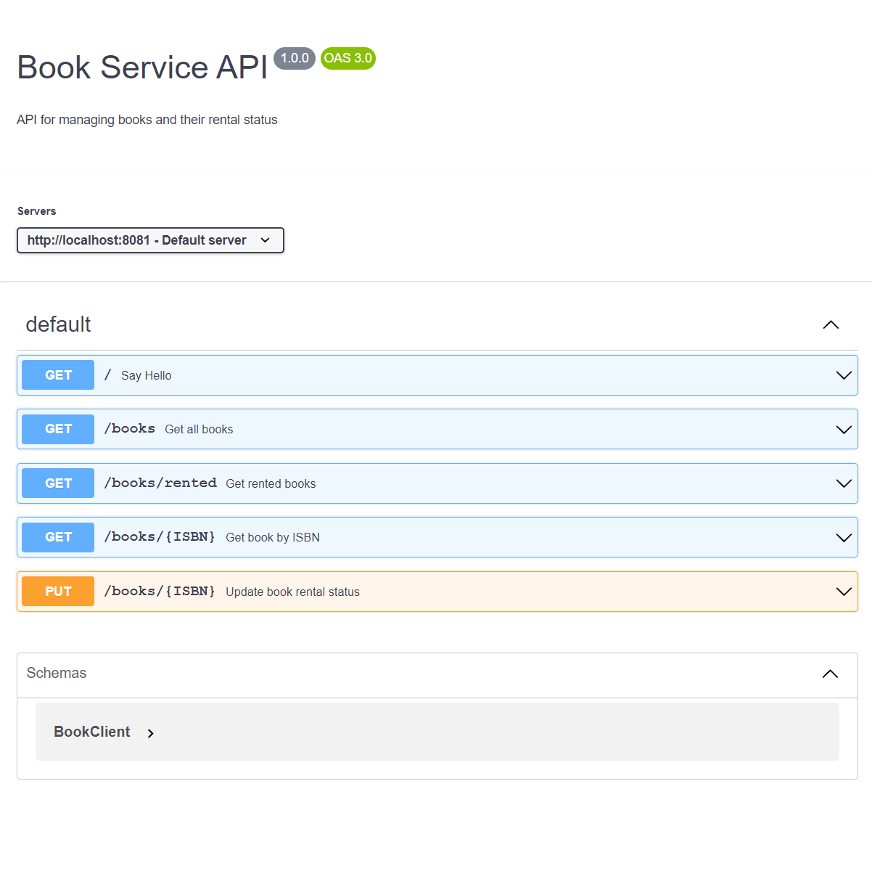

# Project OOS system

This project is for the back end of a library where books can be rented free of charge.

## Requirements

Java 17.

## REST

[`Web Service`](myServiceClient/src/main/java/com/example/myServiceClient/web/WebService.java)


<br>
This is in the paths that the user can access and they are detailed below:

- get http://localhost:8081/ "hello"
- get http://localhost:8081/books "take all books"
- get http://localhost:8081/books/{ISBN} "find books with his ISBN"
- put http://localhost:8081/cars/{ISBN}?rent=true "Change the rent of a books"
- get http://localhost:8081/books/rented "take all rented books"

errors are processed in the logs with errors or warnings depending

---

If you prefer, there's the openAPI file and you can find a screen in it, if you like it on insomnia (API Client) : 
[`OpenAPi`](openapi.yml)
<br>



## Database

[`Book JPA`](myServiceServer/src/main/java/com/example/myServiceServer/data/BookJPA.java)
<br>
all data is stored in memory in an H2 database.
access : http://localhost:8082/h2-console/
<br>
url : `jdbc:h2:mem:testdb`
<br>
name : sa

## GRPC

[`folder`](myServiceServer/src/main/java/com/example/myServiceServer)
<br>
So it's the whole Grpc part that's linked to the database and it's on port 9090.


## Build the whole project

In the root folder (gRPCSpring): 
```
./gradlew build
```

## Launch the server side
In the server folder (myServiceServer):
```
java -jar build/libs/myServiceServer-0.0.1-SNAPSHOT.jar
```

## Launch the client side
In the client folder (myServiceClient):
```
java -jar build/libs/myServiceClient-0.0.1-SNAPSHOT.jar
```

## Contributor

- [Dupont Romain](https://github.com/hodess)
- [Théotime Huybrechts](https://github.com/Thimoclesse)
